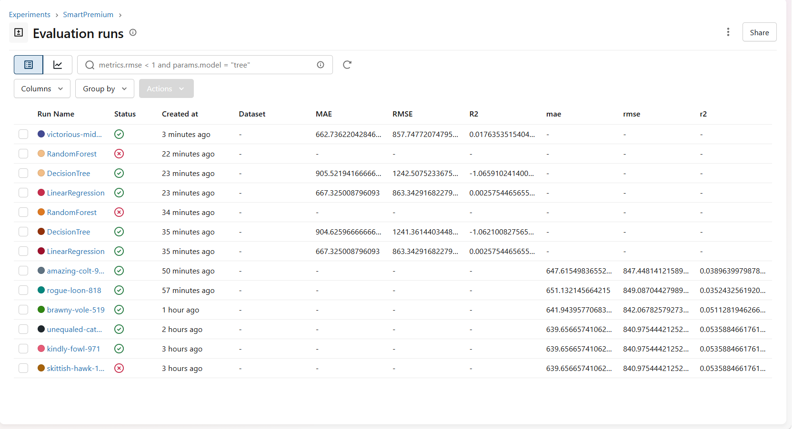
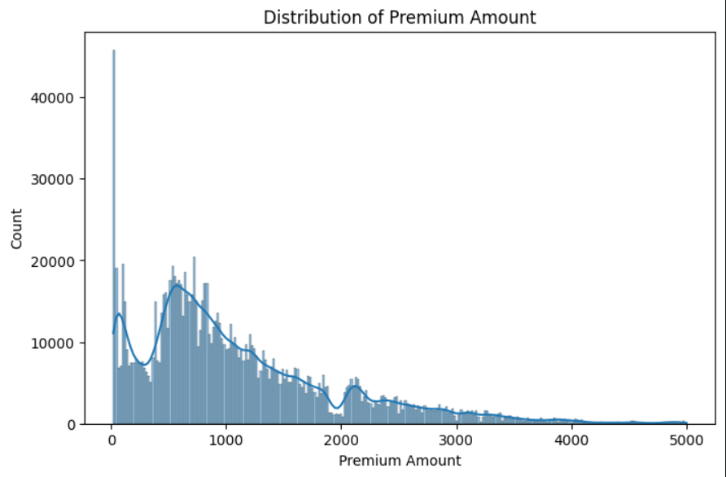
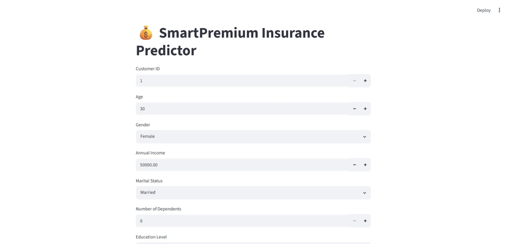
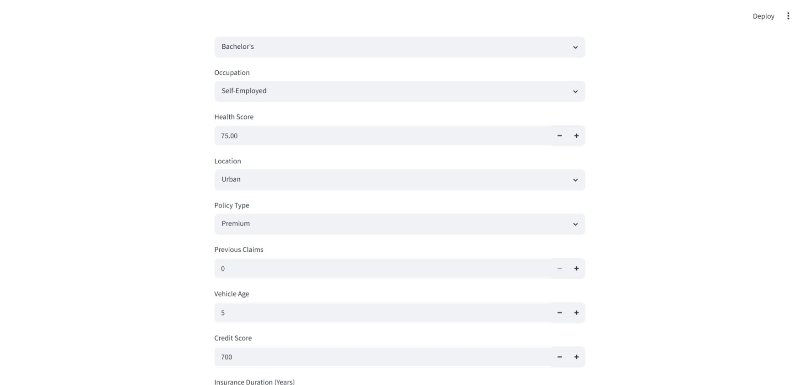
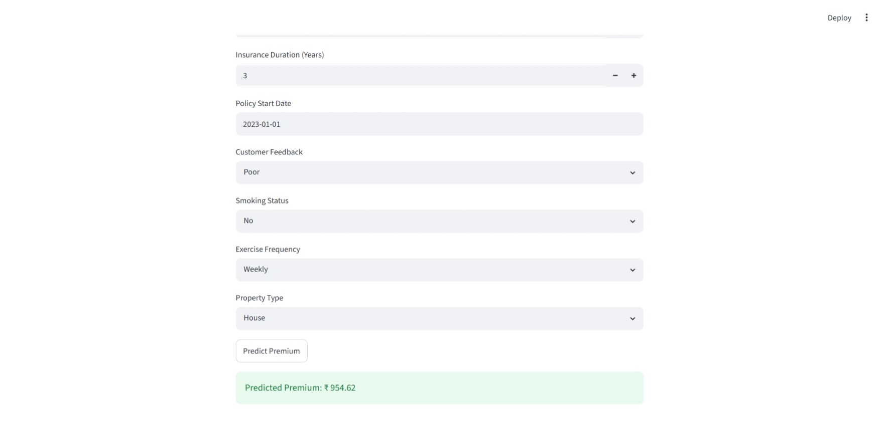

# 💰 SmartPremium: Predicting Insurance Costs with Machine Learning

## Project Overview

SmartPremium is a Machine Learning project that predicts insurance premium amounts based on customer demographics, financial information, health indicators, and policy details.

The project demonstrates the complete Machine Learning lifecycle including data preprocessing, exploratory data analysis (EDA), model training, experiment tracking with MLflow, and deployment using Streamlit.

---

## Problem Statement

Insurance companies use various customer details such as age, income, health score, and policy information to determine insurance premiums.

The objective of this project is to build a machine learning model that accurately predicts insurance premium amounts based on customer characteristics and policy details.

---

## Business Use Cases

* Insurance premium pricing optimization
* Customer risk assessment
* Real-time insurance quote generation
* Healthcare and financial cost estimation

---

## Dataset Information

### Target Variable

* Premium Amount

### Features

* Age
* Gender
* Annual Income
* Marital Status
* Number of Dependents
* Education Level
* Occupation
* Health Score
* Location
* Policy Type
* Previous Claims
* Vehicle Age
* Credit Score
* Insurance Duration
* Policy Start Date
* Customer Feedback
* Smoking Status
* Exercise Frequency
* Property Type

### Dataset Characteristics

* 200,000+ records
* Numerical and categorical features
* Missing values
* Date fields
* Skewed distributions
* Real-world data quality challenges

---

## Project Workflow

### 1. Exploratory Data Analysis (EDA)

* Data inspection
* Missing value analysis
* Statistical summary
* Distribution analysis
* Correlation analysis
* Visualization

### 2. Data Preprocessing

* Missing value handling
* One-Hot Encoding
* Feature Scaling
* Date conversion
* Train-Test Split

### 3. Model Development

The following regression models were implemented:

* Linear Regression
* Decision Tree Regressor
* Random Forest Regressor
* XGBoost Regressor

### 4. Experiment Tracking

MLflow was used for:

* Experiment tracking
* Metric logging
* Model comparison
* Performance monitoring

### 5. Deployment

The final model was deployed using Streamlit for real-time insurance premium prediction.

---

## Evaluation Metrics

The following metrics were used to evaluate model performance:

* Mean Absolute Error (MAE)
* Root Mean Squared Error (RMSE)
* R² Score

---

## Model Performance

| Model             | MAE    | RMSE    | R²      |
| ----------------- | ------ | ------- | ------- |
| Linear Regression | 667.33 | 863.34  | 0.0026  |
| Decision Tree     | 905.52 | 1242.51 | -1.0659 |
| XGBoost           | 662.74 | 857.75  | 0.0176  |

### Best Model

**XGBoost Regressor

Selected because it achieved:

* Lowest MAE
* Lowest RMSE
* Highest R² Score

among the evaluated models.

---

## Technologies Used

* Python
* Pandas
* NumPy
* Scikit-Learn
* XGBoost
* MLflow
* Streamlit
* Joblib
* Matplotlib
* Seaborn

---

Project Structure
SmartPremium/
│
├── data/
│   └── insurance.csv
│
├── notebooks/
│   └── eda.ipynb
│
├── src/
│   ├── preprocess.py
│   ├── train.py
│   └── predict.py
│
├── models/
│   ├── model.pkl
│   └── preprocessor.pkl
│
├── app.py
│
├── images/
│   ├── eda.png
│   ├── mlflow.png
│   └── streamlit.png
│
├── requirements.txt
└── README.md

## How to Run the Project

### Clone Repository

```bash
git clone <repository-url>
```

### Install Dependencies

```bash
pip install -r requirements.txt
```

### Train Model

```bash
python src/train.py
```

### Launch MLflow

```bash
mlflow ui
```

Open:

```text
http://localhost:5000
```

### Run Streamlit Application

```bash
cd app

streamlit run app.py
```

---

## 📸 Streamlit App Screenshots

### 🧠 MLflow Tracking



### 📊 Premium Distribution



### 🚀 Streamlit App - Page 1



### 🚀 Streamlit App - Page 2



### 🚀 Streamlit App - Page 3



---

## 📚 Learning Outcomes

* Data Cleaning
* Feature Engineering
* Exploratory Data Analysis
* Regression Modeling
* Model Evaluation
* MLflow Experiment Tracking
* Streamlit Deployment
* End-to-End Machine Learning Workflow

---

## Author

Dhayalan

Machine Learning Project - SmartPremium
